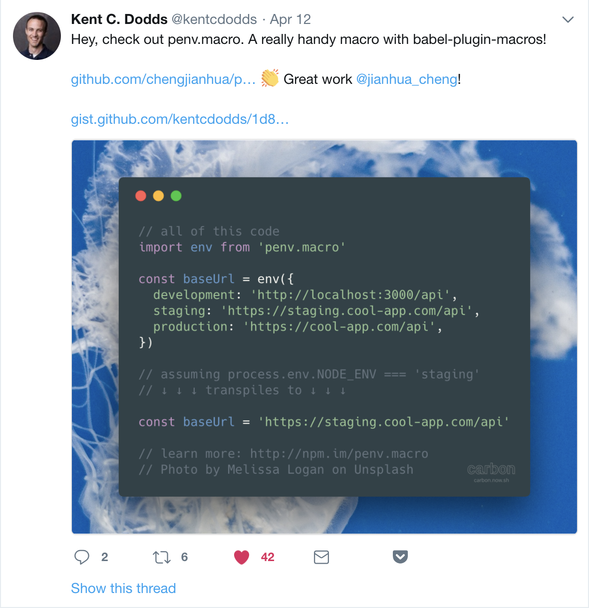

## 介绍

首先, [`penv.macro`](https://github.com/chengjianhua/penv.macro) 是基于 [`babel-plugin-macros`](https://github.com/kentcdodds/babel-plugin-macros) 创建的一个 babel 插件.

它能用来**在一个代码文件中统一管理**你的环境变量, 这些环境变量会在不同的环境下被赋予不同的值. 并且能够做到**只选取和当前环境匹配的值, 然后将其他的值在 babel 转换代码的过程中中移除**. 从而维持了编写时的直观性以及确保不会将与指定环境不相干的代码发布到对应的环境上.



##  用法

具体用法可以参见 [penv.macro README.zh-CN.md](https://github.com/chengjianhua/penv.macro/blob/master/README.zh-CN.md).

## 动机

我们经常会有**一些变量是需要在不同的环境下被赋予不同的值**, 例如接口地址. 开发环境下可能是使用本机的模拟接口 `http://localhost:3000/api/`, 预发环境下是 `https://staging.cool-app.com/api`,  线上环境下是 `https://cool-app.com/api`. **同时我们希望在处于某个环境时, 不属于该环境的配置不应该出现在该环境的代码中**. 例如当发布生产环境代码的时候不希望测试环境相关的配置被打包到生产环境使用的代码中, 这样会暴露内部使用的域名以及发布了完全不需要的代码.

我列举一下在使用 `penv.macro` 之前我所了解的几种便于实现的方法或思路:

1. 使用 `webpack` 的 `DefinePlugin` 或者 `EnvironmentPlugin`, 然后在使用的时候读取 `process.env.BASE_URL` 的值

2. 编写多个配置文件, 通过设置针对不同环境的别名或者是再增加一个入口文件用于判断环境导出对应的配置, 使用时直接导入该模块即可

3. 编写单个文件, 在为变量赋值时手写判断逻辑, 使用时导入该模块即可

以上几种方式或多或少都有其繁琐或者不够合理的地方, `penv.macro` 的诞生正是为了解决配置繁琐以及维护性的问题. 接下来会有详细介绍.

## 对比

在此详细列举出上一段中提到的几种思路的实现, 在末尾总结对比各个方案的, 以便读者更加了解为何 `penv.macro` 是个更优的方案.

### webpack

`webpack.config.js`

```javascript
// used to pick the value for the specified environment
const pickEnv = environmentValues => environmentValues[process.env.NODE_ENV]

module.exports = {
  plugins: [
    new EnvironmentPlugin({
      NODE_ENV: 'production',
      API_BASE: pickEnv({
        development: 'http://localhost:3000/api',
        staging: 'https://staging.cool-app.com/api',
        production: 'https://cool-app.com/api',
      }),
      WECHAT_AUTH: pickEnv({
        development: 'http://localhost:3000/wechat-auth/api',
        staging: 'https://staging.wechat-auth.com/api',
        production: 'https://wechat-auth.com/api',
      })
    }),
  ],
}
```

---

`app.js`

```javascript
const { API_BASE, WECHAT_AUTH } = process.env
```

从实现的便利性上, 这是最接近 `penv.macro` 的方式. 编写简单, 主要问题是太过于依赖 webpack, 如果代码需要测试, 会增加测试环境搭建的复杂度. 读取变量时也不够直观.

### 多个配置文件

`configs/development.js`

```javascript
export const API_BASE = 'http://localhost:3000/api'
```

`configs/staging.js`

```javascript
export const API_BASE = 'https://staging.cool-app.com/api'
```

`configs/production.js`

```javascript
export const API_BASE = 'https://cool-app.com/api'
```

配置别名的情况下:

`.babelrc`

```json
{
  "env": {
    "development": {
      "plugins": [
        [
          "module-resolver",
          {
            "alias": {
              "@/config": "./src/configs/development"
            }
          }
        ]
      ]
    },
    "staging": {
      "plugins": [
        [
          "module-resolver",
          {
            "alias": {
              "@/config": "./src/configs/staging"
            }
          }
        ]
      ]
    },
    "production": {
      "plugins": [
        [
          "module-resolver",
          {
            "alias": {
              "@/config": "./src/configs/production"
            }
          }
        ]
      ]
    }
  }
}
```

增加入口文件并根据环境导出文件:

`config/index.js`

```javascript
if (process.env.NODE_ENV === 'development') {
  module.exports = require('./development')
} else if (process.env.NODE_ENV === 'staging') {
  module.exports = require('./staging')
} else if (process.env.NODE_ENV === 'production') {
  module.exports = require('./production')
}
```

react 的打包文件的入口也正是这么做的: [react/index.js at master · facebook/react](https://github.com/facebook/react/blob/master/packages/react/npm/index.js).

这种情况下在构建时, 如果在 webpack 中通过 `EnvironmentPlugin` 设置了 `process.env.NODE_ENV` 的值之后, 会被替换成具体的值, 然后匹配不到的 `if() {}` 代码块会被代码压缩工具去掉. 从而达到不相干的 配置不会被打包工具打包进最终的 bundle 中.

---

`app.js`

```javascript
import { API_BASE } from '@/config'
```

### 单个文件

`config.js`

```javascript
let API_BASE

if (process.env.NODE_ENV === 'development') {
  API_BASE = 'http://localhost:3000/api'
}

if (process.env.NODE_ENV === 'staging') {
  API_BASE = 'https://staging.cool-app.com/api'
}

if (process.env.NODE_ENV === 'production') {
  API_BASE = 'https://cool-app.com/api'
}

export { API_BASE }
```

---

`app.js`

```javascript
import { API_BASE } from '@/config'
```

显而易见这种方式极其繁琐, 随着文件数的上升, 先不考虑其他, 其所带来的模板代码量也是巨大的. 其消除不需要的值的代码的方式和上一部分的原理相同.

### penv.macro

```javascript
// all of this code
import env from 'penv.macro'

const baseUrl = env({
  development: 'http://localhost:3000/api',
  staging: 'https://staging.cool-app.com/api',
  production: 'https://cool-app.com/api',
})

// assuming process.env.NODE_ENV === 'staging'
// ↓ ↓ ↓ transpiles to ↓ ↓ ↓

const baseUrl = 'https://staging.cool-app.com/api'

// learn more: http://npm.im/penv.macro
```

这种方式的好处在于可以就近维护一个变量在不同环境下的值, 且使用方式很透明, 使用者只需要像使用一个普通的方法一样来使用它. 导入配置文件时只需要像对待一个普通的模块来对待它, 不需要使用额外的别名配置或者判断.

### 结论

| --             | webpack | 多配 <br /> (别名) | 多配 <br /> (动态导出) | 单配 | `penv.macro` |
| -------------- | ------- | ------------------ | ---------------------- | ---- | ------------ |
| 代码量         | ✅      | 🚫                 | 🚫                     | ✅   | ✅           |
| 就近管理       | ✅      | 🚫                 | 🚫                     | 🚫   | ✅           |
| 不依赖压缩工具 | 🚫      | ✅                 | 🚫                     | 🚫   | ✅           |
| 不依赖 webpack | 🚫      | ✅                 | 🚫                     | 🚫   | ✅           |
| 不依赖 babel   | ✅      | 🚫                 | ✅                     | ✅   | 🚫           |

其中 `penv.macro` 的方式明显优于其他的方式, 我们现在前端的代码难免都会依赖 babel, 所以依赖 babel 实际上不算是个问题.

其中就近维护变量的值很重要. 如果不能就近维护, 假设你在多个文件中设置变量时, 无论是一开始编写抑或是之后的二次修改, 都必须记得要修改多个文件. 时常会出现只改了一两处, 而漏掉其他地方的情况. 这也是我编写 `penv.macro` 的主要动机, 希望能在一个位置看到该变量的各个环境下的值, 这样更能把握一个变量的整体情况.

不依赖 webpack 也是很有必要的, 如果我们的代码需要被测试, 且测试的代码不得不依赖 webpack 的话, 配置测试环境也将会变得更复杂. 应尽力避免这样的情况发生, 徒增不必要的复杂度是不明智的.

## babel-plugin-macros

[`babel-plugin-macros`](https://github.com/kentcdodds/babel-plugin-macros) 是一个特别的 babel 插件, 特别在它本身不提供任何直接的功能. 你需要使用基于它创建出的 macro, 并且只需要在 `.babelrc` 的 `plugins` 中 加入 `babel-plugin-macros`. 后续的使用只需要导入对应的 macro, 而不需要额外配置 `.babelrc`.

在我的理解中, 如果类比说 babel 是提供了一个平台, 而各个 babel 插件是基于 babel 这个平台创建的工具. 那么, `babel-plugin-macros` 就像是基于 babel 插件之上创造了另一个平台: 我们能基于 `babel-plugin-macros` 编写我们想要的 macro (本质上也是一个 babel 插件), 只不过接受的参数是由 `babel-plugin-macros` 为我们处理过再传递过来的.

一般的 babel 插件都是**隐式**的, 这么说的原因是 babel 插件要么基于某种语法, 要么基于某种写法, 当然也有的会通过注释来只对部分代码做转换. 与此相比, 基于 `babel-plugin-macros` 编写的 macro 是**显示**调用和执行的. 因为我们需要 `import` / `require` `xxx.macro`, 然后以类似函数调用或者其他的方式 (模板标签等) 来使用它. 虽然实际上不是函数, 但是我们确实能在 macro 中读到用户传给它的参数或者其他的形式的信息, 然后转换用户编写的代码.

这是个非常具有创意的想法, [Kent C. Dodds](https://kentcdodds.com/info/) 打开了我们使用 babel 插件的一种新思路. 以下是作者在 babel 的博客中发布的相关文章:

[Zero-config code transformation with babel-plugin-macros · Babel](http://babeljs.io/blog/2017/09/11/zero-config-with-babel-macros)

